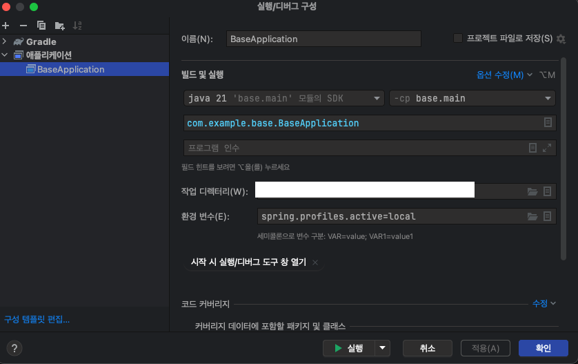
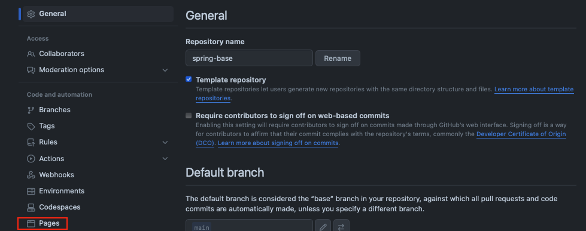
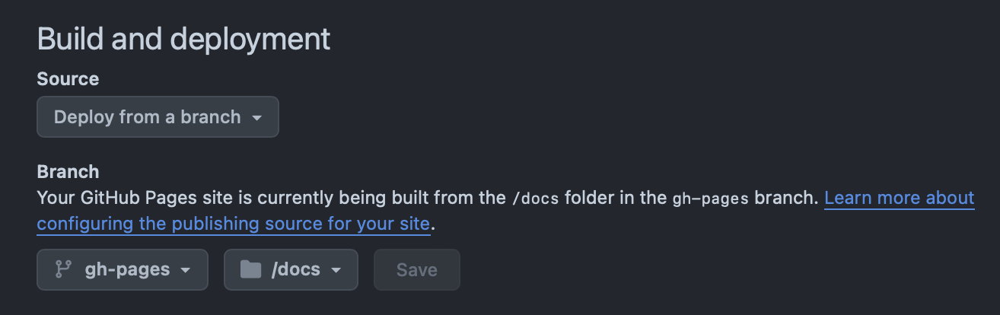

# Spring-base 


프로젝트 설명...


- 개인 프로젝트에 사용 될 Spring-boot boiler plate입니다.
- Template repository로 설정되어있습니다.

## 특징
### 🌐 전역적, 유지보수가 쉬운 에러 핸들링
- 모든 에러에 대한 [RFC 7807](https://datatracker.ietf.org/doc/html/rfc7807) spec response
  - Spring core의 ProblemDeatil를 사용한 CustomException을 extends 또는 사용할 수 있습니다.
  - Spring의 core의 `ResponseEntityExceptionHandler`을 override하여 ProblemDetail를 참조하여 일관된 에러 핸들링을 합니다.

### 🚪 Test Container
- Test Container를 통해 격리된 한경에서 test 수행이 가능합니다.

### 📝 Github pages
- Test 정보, api명세서등 document는 release가 publish되면 [Github page](https://can019.github.io/spring-base)에 자동으로 upload됩니다.

### ⚙️ Release note 자동화

- Release가 되면 자동으로 workflow가 draft를 작성해줍니다.

### ⚙️ Sonar cloud를 통한 정적 분석

- CI에서 Sonar cloud를 이용해 정적 분석을 진행합니다.
  - 해당 PR에서 추가된 source code에 대해 평가합니다.


## 프로젝트 환경
- Java version: 21
  - distribution: 'temuri
- Gradle version: 8.7

## 환경변수
### 유효 프로퍼티
- local_docker
- local
- dev
- prod
- test

### 환경변수 세팅
#### Intellij community
> 

## 초기 설정
### Github pages
main branch에서 아래 명령어를 입력 해 gh-pages branch로 checkout 합니다.
```shell
git checkout --orphan gh-pages
```
아래 명령어를 통해 git에 캐시된 정보를 모두 삭제합니다.
```shell
git rm --cached -r .
```
아래 명령어를 통해 Github pages 구성에 필요한 정보를 gh-pages에 push 합니다.
```shell
rm -rf docs
mkdir docs
cp -R gh-pages/docs ./

git add docs
git commit -m "init"
git push origin gh-pages
```

이 다음 repository setting에 들어가서 github pages를 설정합니다.

> 

> 


### Docker (설치)
- mac x86에서만 확인되었습니다.

`./init.sh` 실행

``` shell
./init.sh
```

### Sonar cloud
[Sonar cloud repository 설정](https://chaerim1001.tistory.com/94)
